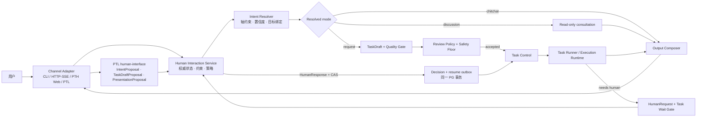
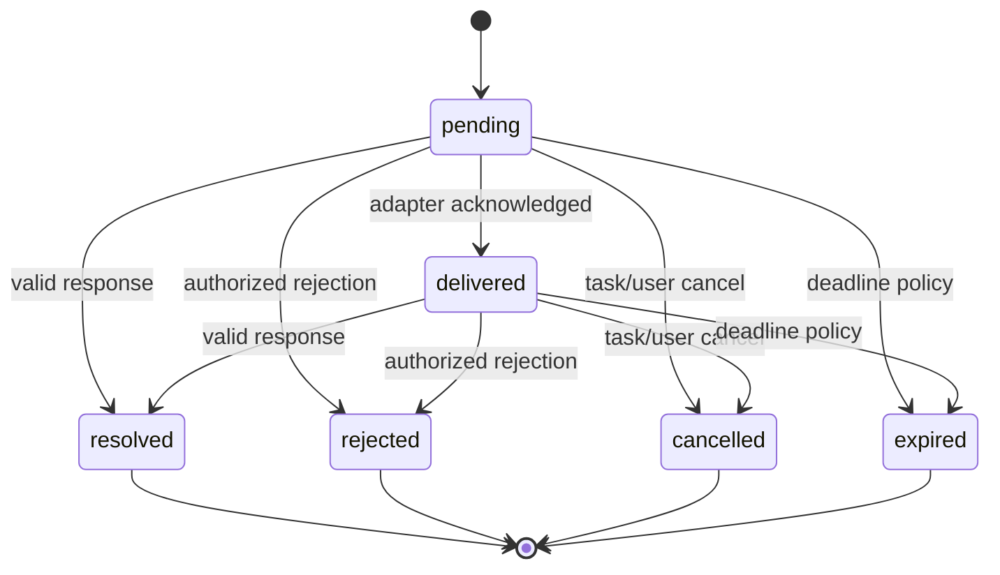

# N25：PTH Human Interaction 协议设计

> 日期：2026-08-18  
> 状态：**部分实施**——HumanRequest HTTP 路由 / PG 持久化 / waiting-human 暂停语义已落地（`src/pth/gateway/routes-human-interaction.ts`、`src/pth/interaction/human-interaction-{service,repository}.ts`、`packages/pth-contracts/src/human-interaction.ts`）；完整协议（intent resolver / TaskDraft / Quality Gate / Presentation）未实施。2026-08-24 已补 IntentProposal / TaskDraft / TaskDraftSubmission / QualityGateResult 契约类型与结构校验，并新增确定性 Intent Resolver（`intent-resolver.ts`）、TaskDraft Service（`task-draft-service.ts`，内存 + Repository 缝）、Presentation/Output Composer（`presentation.ts`）。  
> 边界裁决：[ADR-0005（旧仓归档）](https://github.com/Phenol1145/pi-triple/blob/main/docs/adr/0005-pth-human-interaction-boundary.md)；角色所有权修订：[ADR-0006（旧仓归档）](https://github.com/Phenol1145/pi-triple/blob/main/docs/adr/0006-ptl-human-interface-role-boundary.md)
> 术语事实源：[CONTEXT.md](../../../CONTEXT.md)  
> 契约复验输入：[v1.2 F1–F5 复验报告](../report/v1.2-acceptance-fix-revalidation.md)

## 0. 执行摘要

PTH 需要自己的 Human Interaction bounded context，才能兑现“接收自然语言意图并直接产出
执行结果”的产品定位。该 context 同时覆盖入口与执行中断两类交互：

1. 识别用户输入是在闲聊、讨论还是请求工作；
2. 把请求编译成可执行、可审核、可追溯的 Task Draft；
3. 按用户偏好展示或隐藏稿件，但不降低安全审核底线；
4. 将内部结果改写为适合用户阅读、同时保持事实与状态不变的输出；
5. 当任务执行中需要澄清、选择、材料或批准时，可靠地等待人类并在答复后恢复。

核心裁决如下：

- **PTH 拥有协议和持久状态。** PTL、CLI、HTTP/SSE、未来 Web 与 mailbox 都只是 adapter。
- **`human-interface` 是 PTL 的按需语义角色，不是 PTH batch worker。** 它通过公开协议产生 proposal，不拥有最终状态或授权。
- **LLM 提议，服务器裁决。** LLM 输出 IntentProposal；确定性约束、策略和能力元数据生成 ResolvedIntent、EffectAssessment 与 review route。
- **Task Draft 与 Task 分离。** Draft 是可版本化工作承诺；只有通过质量门和审核后才编译成 TaskSubmission。
- **等待人类是真实 blocked gate。** 不用 retryable reject、普通 pending 或子任务 await 模拟。
- **PostgreSQL 是真相源。** Redis/SSE 只负责低延迟通知；决定、恢复与审计不能依赖进程内状态。
- **审核可调，安全底线不可调。** `reviewPolicy` 与 `draftPresentation` 相互独立。

## 1. 范围与非范围

### 1.1 本设计覆盖

- InteractionSession 与有序 Turn；
- 多轴意图模型及轴间约束；
- TaskDraft revision、质量门、展示偏好与提交证明；
- 可调 ReviewPolicy、不可变 safety floor 与 ApprovalDecision；
- 执行中 HumanRequest/HumanResponse、超时、取消、等待与恢复；
- 用户可见输出的真实性约束和表达调整；
- stable principal、tenant、CAS、幂等、审计、transactional outbox；
- PTH CLI、HTTP/SSE、未来 PTH Web 和 PTL/mailbox adapter 的同构语义；
- 旧 workflow/fallback/session 的迁移关系。

### 1.2 本设计不覆盖

- 不复活通用 workflow engine；
- 不把 PTL 重新定义成 PTH 前端；
- 不把 `human-interface` 加进常驻 worker 数量或普通任务路由；
- 不暴露模型 chain-of-thought；
- 不允许用户偏好绕过租户、身份、权限或高风险 safety floor；
- 不在本设计中实现 UI 视觉稿、模型训练或领域知识填充；
- 不把已有 `fallback_requests`、mailbox 或 AgentEngine Session 改名后冒充新协议。

## 2. 领域边界与职责



| 参与者 | 拥有 | 不拥有 |
|---|---|---|
| Human Interaction Service | session/turn、intent resolution、draft/review/request/response 状态、presentation policy | Task 的 claim/lease/terminal 状态；LLM 执行 |
| PTL `human-interface` | 结构化 proposal、用户语言改写建议 | PTH 数据库状态、授权、effect 真值、审批决定、任务认领 |
| Task Control | TaskSubmission、任务状态、lease、blocked gate、cancel/resume | 用户表达、意图分类模型 |
| Task Runner | 执行已租借任务并返回 outcome 或 suspension | Task 状态迁移、人类身份判断 |
| Channel Adapter | 认证上下文传递、输入/输出渲染、断线重连 | 领域状态、policy、actor 自报、恢复裁决 |
| PostgreSQL | durable truth、revision、decision、outbox | 实时 UI 连接 |
| Redis / SSE | notification、短期 fan-out、presence | 审批与恢复真相 |

## 3. 意图模型

### 3.1 五个轴

#### Mode：交互能力上限

| 值 | 含义 | 允许的最高能力 |
|---|---|---|
| `chitchat` | 寒暄、礼貌、情绪回应、轻量元对话 | 仅会话内生成；不得建任务或访问外部可变状态 |
| `discussion` | 解释、比较、探索、评估、推演、共同思考 | 可读知识、做分析、咨询只读角色；不得产生外部副作用 |
| `request` | 用户希望系统创建、改变、操作、验证、监控或协调某件事 | 可形成 TaskDraft；副作用由 effect 与 review 决定 |

Mode 不是一句话的“主题”，而是本轮允许系统走多远的 capability ceiling。

#### Dialogue Act：这一句话在对话中做什么

基础分类进一步细分为：

| 大类 | acts |
|---|---|
| `social` | `greet`、`thank`、`farewell`、`empathize`、`small-talk` |
| `inquire` | `ask-fact`、`ask-explain`、`ask-example`、`ask-compare`、`ask-status` |
| `deliberate` | `explore`、`brainstorm`、`evaluate`、`challenge`、`decide-with-me` |
| `request-work` | `create`、`change`、`diagnose`、`review`、`verify`、`operate`、`monitor`、`coordinate` |
| `control` | `clarify`、`confirm`、`correct`、`continue`、`pause`、`cancel`、`retry`、`set-preference` |
| `feedback` | `accept-result`、`reject-result`、`report-problem`、`refine-output` |

Dialogue Act 可以比 Mode 更细，但不能突破 Mode 的能力上限。

#### Goal：用户希望最终得到什么

Goal 使用稳定的工作目的，而不是角色名或执行步骤：

```text
understand | explore | decide | create | change | diagnose |
verify | operate | monitor | coordinate | converse
```

Goal 可以带领域化参数，例如 `create(document)`、`verify(implementation)`，但不能直接指定
“由 developer 执行”；role routing 仍由 Task Control/Catalog 决定。

#### Target：作用于哪个对象

```text
none | conversation | prior-turn | task-draft | task |
artifact | pth-resource | external-system
```

Target 必须包含可验证引用，例如 `draftId + revision`、`taskId` 或 artifact ref。诸如“继续”、
“取消它”、“就按刚才的”属于 control act，必须先从会话状态解析 target，不能创建一个新目标。

#### Effect：执行会对世界造成什么影响

Effect 是逻辑轴，但不是 LLM 自报字段。它在 TaskDraft 形成后由能力目录和资源策略计算：

```ts
interface EffectAssessment {
  scope:
    | "conversation"
    | "read-only-data"
    | "workspace"
    | "pth-state"
    | "external-system";
  reversibility:
    | "no-state-change"
    | "reversible"
    | "conditionally-reversible"
    | "irreversible";
  risk: "low" | "medium" | "high" | "critical";
  capabilityEvidence: readonly string[];
  policyVersion: string;
}
```

每个 capability 必须有 server-owned effect descriptor；组合任务取安全上界，不允许
PTL `human-interface` 或 TaskDraft 作者把风险向下覆盖。

### 3.2 Proposal 与权威解析分离

```ts
interface AxisProposal<T> {
  value: T;
  confidence: number;          // 0..1
  evidenceTurnIds: readonly string[];
  rationaleCode?: string;      // 短码，不保存 chain-of-thought
}

interface IntentProposal {
  proposalId: string;
  sessionId: string;
  sourceTurnIds: readonly string[];
  mode: AxisProposal<"chitchat" | "discussion" | "request">;
  dialogueAct: AxisProposal<string>;
  goal?: AxisProposal<string>;
  target?: AxisProposal<TargetRef>;
  ambiguities: readonly IntentAmbiguity[];
  classifierVersion: string;
}
```

LLM 只能提交 `IntentProposal`。服务器读取会话状态、目标实体、权限和 policy 后生成判别联合：

```ts
type ResolvedIntent =
  | { kind: "chitchat"; mode: "chitchat"; act: string }
  | { kind: "discussion"; mode: "discussion"; act: string; goal: string; target?: TargetRef }
  | { kind: "task-request"; mode: "request"; act: string; goal: string; target?: TargetRef }
  | { kind: "control"; mode: "discussion" | "request"; act: string; target: TargetRef }
  | { kind: "needs-clarification"; questions: readonly ClarificationQuestion[] };
```

### 3.3 轴间约束

约束按以下顺序执行，而不是让分类器自由组合：

1. **先解析会话状态与 Target，再解释 Dialogue Act。** “确认”只有绑定待确认 revision 才有效。
2. **Control act 继承目标的 mode。** “取消任务”仍是 request control；“继续讨论”仍是 discussion。
3. **Mode 是 capability ceiling。** discussion 可读不可写；任何写操作必须重新解析成 request。
4. **Goal 描述承诺，不描述执行者。** role、tool 和 model 都只是 execution hints。
5. **Effect 在 draft 后计算。** IntentProposal 不得决定 scope/reversibility/risk。
6. **关键轴低置信度必须澄清。** 关键轴包括 target、是否产生副作用、不可逆参数、金额/收件人/发布范围。
7. **非关键歧义可写入 assumptions。** 但 assumptions 必须展示或受 ReviewPolicy 约束。
8. **Correction 不直接覆盖历史。** 它创建新 Turn 和新 Draft revision，并以 supersedes 关联旧版本。
9. **Confirmation 必须绑定版本。** 未带 target revision/hash 的“确认”不能作为 ApprovalDecision。
10. **权限不能由意图提升。** 即便用户明确请求，当前 principal 无权限仍应拒绝或请求有权主体。

### 3.4 典型边界场景

| 输入 | ResolvedIntent | 关键理由 |
|---|---|---|
| “你好，今天怎么样？” | chitchat | 无工作承诺、无外部目标 |
| “我们讨论一下这个架构是否合理” | discussion/evaluate | 可检索与咨询，只读 ceiling |
| “把讨论结果写成设计稿并保存” | task-request/create | 出现持久 artifact，必须进入 draft |
| “继续” | control | 必须绑定最近可继续的 discussion/task/request；歧义时澄清 |
| “就按刚才方案执行” | control/confirm | 必须绑定明确 draft revision/hash；否则不得提交 |
| “看看这个文件” | discussion 或 request | 只读解释为 discussion；要求修改则为 request |
| “帮我盯着，变了告诉我” | task-request/monitor | 创建持续任务和未来通知 |
| “不用问我，直接删掉” | task-request/operate | 用户偏好不能越过不可逆 safety floor |

## 4. InteractionSession 与 Turn

InteractionSession 是 PTH 的领域会话，不等于 AgentEngine Session。最小字段：

```ts
interface InteractionSession {
  sessionId: string;
  scope: TenantScope;
  participants: readonly ParticipantRef[];
  channelOrigin: string;
  reviewPolicyRef: { policyId: string; version: number };
  presentationPolicyRef: { policyId: string; version: number };
  status: "active" | "archived";
  rowVersion: number;
  createdAt: string;
  updatedAt: string;
}

interface InteractionTurn {
  turnId: string;
  sessionId: string;
  seq: number;
  actor: { kind: "human" | "assistant" | "system"; principalId: string };
  content: readonly ContentPart[];
  correlationId: string;
  causationId?: string;
  clientRequestId?: string;
  createdAt: string;
}
```

不变量：

- Turn append-only；订正以新 Turn 表达；
- `(tenantId, sessionId, seq)` 唯一且单调；
- `clientRequestId` 在 tenant/principal/channel 范围内幂等；
- actor 由认证/系统派生，不接受 body 自报；
- attachment 使用 versioned ResourceRef，不把任意本地路径写进协议；
- AgentEngine session 可被某次 consultation 引用，但不是 InteractionSession 的存储后端。

## 5. Task Draft 与质量门

### 5.1 不可变 revision

```ts
interface TaskDraftRevision {
  draftId: string;
  revision: number;
  sessionId: string;
  sourceTurnIds: readonly string[];
  supersedesRevision?: number;

  title: string;
  objective: string;
  context: readonly string[];
  constraints: readonly string[];
  assumptions: readonly string[];
  nonGoals: readonly string[];
  deliverables: readonly DeliverableSpec[];
  acceptanceCriteria: readonly AcceptanceCriterion[];
  inputRefs: readonly ResourceRef[];
  openQuestions: readonly OpenQuestion[];
  executionHints?: ExecutionHints;        // 非权威

  effectAssessment: EffectAssessment;     // server-computed
  qualityAssessment: DraftQualityAssessment;
  contentHash: string;                    // canonical serialization hash
  createdBy: string;
  createdAt: string;
}
```

Draft revision 只增不改；`lease_generation` 绝不能复用为 revision。内容、输入引用、assumption、
acceptance criteria 或 effect 任一变化都创建新 revision/hash。

### 5.2 Draft Quality Gate 永远开启

可调的是审核策略，不是稿件最低质量。提交前至少满足：

- objective 非空且不自相矛盾；
- deliverable 与 acceptance criteria 可对应；
- critical open question 为零；
- 关键输入引用可访问且版本明确；
- assumptions 与用户明确指令不冲突；
- non-goals 不吞掉 objective；
- effect 已由能力元数据计算；
- tenant、target、domain binding 与权限校验通过；
- 不包含 secret 回显、伪造主体或不可执行的隐藏依赖。

质量门输出 `pass | clarify | reject`。`clarify` 生成 Interaction 层问题，不创建 runnable task。

### 5.3 Draft 展示偏好

```ts
type DraftPresentation = "hidden" | "summary" | "full";
```

- `hidden`：不主动展示稿件正文；需要确认时仍展示决定所需的目标、影响和关键 assumption；
- `summary`：展示 objective、deliverables、关键 constraints/effect；
- `full`：展示完整 TaskDraft revision；
- 该偏好只影响显示，不影响质量门、ReviewPolicy 或 safety floor。

## 6. 可调审核策略

### 6.1 Policy 与 safety floor 分离

```ts
interface ReviewPolicySnapshot {
  policyId: string;
  version: number;
  mode: "auto" | "adaptive" | "confirm-all" | "custom";
  draftPresentation: DraftPresentation;
  rules: readonly ReviewRule[];
  eligiblePrincipals: readonly PrincipalSelector[];
  quorum?: number;
  expiresAt?: string;
  createdAt: string;
}
```

| 模式 | 语义 |
|---|---|
| `auto` | quality pass 且未触发 safety floor 时自动提交 |
| `adaptive` | 按 confidence、effect、novelty、target 和 policy rule 路由 |
| `confirm-all` | 每个 draft revision 都需显式确认 |
| `custom` | 使用租户/主体定义规则；未命中时采用安全默认 |

不可配置关闭的 safety floor 至少包括：

- cross-tenant、主体不明或 target revision 不明确；
- irreversible 或 critical effect；
- 高风险外部发布、资金/权限/凭据/法律承诺；
- 关键 assumption 未获确认；
- policy/authorization 解析失败；
- capability effect metadata 缺失——按未知高风险 fail-closed。

### 6.2 Review route

```text
auto-submit
show-and-confirm
clarify
reject
require-privileged-review
```

ApprovalDecision 必须绑定：

```text
tenantId + principalId + draftId + revision + contentHash
+ effectAssessmentHash + reviewPolicy(version) + decision + decidedAt
```

任何内容 mutation、effect 升级、target 改变或 policy safety revision 变化都会使旧批准失效。
重复提交相同 idempotency key 返回原决定；并发相反决定以 CAS 只允许一个胜者，其余返回 conflict。

### 6.3 TaskSubmission

通过审核后生成不可变提交封套，再编译到现有 TaskWorkItem：

```ts
interface TaskSubmission {
  submissionId: string;
  scope: TenantScope;
  draft: { draftId: string; revision: number; contentHash: string };
  reviewProof: ReviewProof;
  resolvedIntentId: string;
  work: TaskWorkItem;
  submittedAt: string;
}
```

`executionHints` 不能直接决定 assignedRole、capability grant 或最终 domain；Task Control/Catalog 必须
重新校验并服务端盖章。

## 7. 执行中的 Human Request / Response

### 7.1 请求类型

```text
question | choice | approval | form | artifact
```

HumanRequest 至少包含：

```ts
interface HumanRequest {
  requestId: string;
  tenantId: string;
  sessionId: string;
  turnId: string;
  taskRef?: { taskId: string; leaseGeneration: number };
  draftRef?: { draftId: string; revision: number };
  kind: "question" | "choice" | "approval" | "form" | "artifact";
  prompt: UserFacingContent;
  responseSchema?: JsonSchemaRef;
  allowedActions: readonly string[];
  contextSummary: string;
  effectAssessment?: EffectAssessment;
  requestedBy: PrincipalRef;
  assignedTo: readonly PrincipalSelector[];
  state: "pending" | "delivered" | "resolved" | "rejected" | "cancelled" | "expired";
  requestRevision: number;
  rowVersion: number;
  expiresAt?: string;
  idempotencyKey: string;
  createdAt: string;
}
```

HumanResponse 是 append-only record，必须带 `requestId + expectedRequestRevision + principalId +
idempotencyKey`，并保存 schema validation 结果。ApprovalDecision 是 HumanResponse 的受约束子型，
不能用普通文本“同意”替代。

### 7.2 状态机



只有 `pending/delivered` 可接收首次有效决定。重复相同响应幂等返回；不同响应返回 conflict，
不得覆盖已决定记录。

### 7.3 Task wait gate

Task Runner 的结果扩展为：

```ts
type TaskRunResult = TaskOutcome | TaskSuspension;

interface TaskSuspension {
  kind: "suspended";
  reason: "human-request";
  lease: TaskLeaseReference;
  requestId: string;
  expectedRequestRevision: number;
  deadline?: string;
  traceId: string;
}
```

Task Control 原子执行：

1. 校验 taskId/leaseId/generation；
2. 插入 HumanRequest；
3. 插入 task wait gate；
4. 将任务迁为 `waiting-human`（或通用 `blocked` + gate kind）；
5. 清除执行 lease，但保留 generation/fence；
6. 写 interaction event/outbox。

`waiting-human` 绝不被普通 claim 查询选中，也不消耗 retry/claims budget。

### 7.4 Response → resume 单事务

接受人类响应时，同一个 PostgreSQL transaction 必须：

1. 以 tenant + requestId `FOR UPDATE` 读取请求；
2. 校验 stable principal、assignment、状态、deadline、expected request revision；
3. 插入不可变 HumanResponse/ApprovalDecision（idempotency unique）；
4. CAS 请求 `pending|delivered → terminal`；
5. 更新 task wait gate 为 satisfied/rejected/expired；
6. 按 policy 将 Task 迁为 `pending`、`cancelled` 或 `rejected`；
7. 写 `human-response.accepted` 与 `task.resume` transactional outbox；
8. commit 后再由 adapter/SSE 通知。

恢复后的 runner 通过 requestId 读取 response snapshot；response 不能只存在于 task payload 的可变
JSONB 中。stale worker、stale adapter 和重复 outbox handler 都不能改变已提交决定。

### 7.5 超时策略

HumanRequest 保存绝对 `expiresAt`，由可恢复 sweeper 用 CAS 处理。Policy 可选择：

```text
remain-blocked | cancel-task | reject-task | use-explicit-default
```

禁止隐式“超时即批准”。`use-explicit-default` 必须在创建请求时写明默认值及其 effect，并通过
safety floor。进程内 `setTimeout` 只能优化唤醒，不能作为真相。

## 8. 面向用户的输出调整

PTL `human-interface` 可以改变语言、结构、详略和渠道格式，但不能改变事实、状态、风险或决定。

### 8.1 Canonical result 与 presentation 分离

```ts
interface UserFacingEnvelope {
  interactionId: string;
  status: "informational" | "needs-input" | "submitted" | "running" | "completed" | "failed" | "cancelled";
  headline: string;
  summary: string;
  deliverables: readonly PresentedArtifact[];
  evidence: readonly PresentedEvidence[];
  decisionsRequired: readonly PresentedDecision[];
  warnings: readonly string[];
  uncertainty?: readonly string[];
  nextActions: readonly PresentedAction[];
  canonicalRefs: readonly ResourceRef[];
}
```

Output Composer 读取 canonical outcome、review/request 状态和 PresentationProposal，再产生 envelope。
以下字段受保护，不能被文案层改写为更乐观的值：

- terminal/non-terminal status；
- 成功/失败数量、金额、时间、收件人、权限和目标资源；
- evidence/source 与“不确定/未验证”标记；
- safety warning、待用户决定项、partial completion；
- artifact identity/hash 与 task/draft/request refs。

### 8.2 按意图调整表达

| 场景 | 输出原则 |
|---|---|
| chitchat | 自然简短，不虚构任务进度 |
| discussion | 先给结论/观点，再给依据与分歧；明确仅讨论、未执行 |
| draft hidden | 给必要 effect/assumption/确认问题，不泄露无关内部结构 |
| draft summary | 展示目标、产物、关键约束、风险和待确认项 |
| draft full | 展示完整 revision 与 acceptance criteria |
| task running | 只报告已发生状态，不把计划写成完成 |
| needs-input | 明确问题、允许动作、deadline、默认策略和影响 |
| completed | 结果、产物、验证证据、残余缺口、可选下一步 |
| failed/partial | 失败边界、已完成部分、是否产生副作用、恢复选择 |

不输出隐藏 chain-of-thought；需要解释时输出简洁 decision rationale、evidence 和 policy code。

## 9. Contract 变更方案

### 9.1 可直接复用

| 现有 contract/机制 | 用法 |
|---|---|
| `TenantScope` | session/request/response/task 的 tenant、principal、roles、trace 基础封套 |
| `TaskLease` + generation + commit CAS | suspension/resume 的 fencing 设计方法 |
| `DomainBinding` | IntentBinding 的 version/confidence/evidence 表达参考；不直接复用语义 |
| `ExecutionGrant` | discussion read-only 与 request execution 的 capability enforcement |
| `TaskWorkItem` | accepted TaskDraft 编译后的执行输入，不充当 draft store |
| SSE writer / ActivityHub | transport 与实时 fan-out；不作为 durable event source |

### 9.2 新增公共 DTO

新增 `src/pth/contracts/human-interaction.ts`，只放跨模块纯 DTO、discriminated unions 与结构校验：

- InteractionSession / InteractionTurn；
- IntentProposal / ResolvedIntent / IntentResolution；
- TargetRef / EffectAssessment；
- TaskDraftRevision / TaskSubmissionSource；
- ReviewPolicySnapshot / ReviewDecision / ReviewProof；
- HumanRequest / HumanResponse / ApprovalDecision；
- InteractionEvent envelope。

领域行为、repository 和 transaction 不塞进 contracts barrel；它们归 `src/pth/interaction/` 的公开
application API。

### 9.3 小幅扩展既有 contract

- `identity.ts`：保持 TenantScope，认证 adapter 必须提供稳定 subject/principal、scopes、token/session id；
- `tasking.ts`：增加 TaskSubmission provenance、TaskSuspension/TaskRunResult、TaskWaitGate port；
- Runtime Catalog：增加 `roleKind: task-worker | interaction-agent | governance`、
  `invocationMode: resident | on-demand`、`poolEligible`；
- Capability Catalog：从字符串能力升级/旁挂 `CapabilityEffectDescriptor`；
- ResourceRef：增加 version/hash/mediaType/access scope/locator；
- SSE envelope：eventId、session/turn/request correlation、heartbeat 与 replay cursor。

### 9.4 明确禁止的复用

- 不扩张 TaskOutcome 使其同时代表人类决定；
- 不把 TaskDelivery `replyTo` 增加 `human` 后当作完整交互；
- 不把 TaskAwait 的直接子任务语义泛化为 HumanRequest；
- 不把 `lease_generation` 当 draft/request revision；
- 不把 AgentEngine SessionEntry 当 InteractionTurn truth；
- 不把旧 `awaiting_approval`、fallback open/closed 或 mailbox pending 当新状态机；
- 不把 interaction 数据只放在 opaque task payload。

## 10. 持久化模型与一致性

建议由 Interaction module 自有下列表/ports，命名可在实现计划中调整：

| 实体 | 关键唯一性/不变量 |
|---|---|
| `interaction_sessions` | `(tenant_id, session_id)`；row_version CAS |
| `interaction_turns` | `(tenant_id, session_id, seq)`；turn_id；client request idempotency |
| `intent_resolutions` | source turns + classifier/resolver/policy version；append-only |
| `task_draft_revisions` | `(tenant_id, draft_id, revision)`；content_hash 唯一绑定内容 |
| `review_policy_snapshots` | policy id + version；不可原地改历史 |
| `review_decisions` | target revision + principal + idempotency；append-only |
| `human_requests` | tenant/request id；request_revision + row_version + state CAS |
| `human_responses` | request + response id；principal + idempotency；append-only |
| `task_wait_gates` | task + gate generation；一个 active gate 的唯一约束 |
| `interaction_outbox` | tenant-qualified key；processing lease/token；availableAt/backoff |

所有外键/唯一键都包含 tenant。查询不能先按全局 id 找行后再检查 tenant。

Interaction outbox 必须满足：

- 与业务状态同一 transaction enqueue；
- 原子 pending→processing claim；
- claim token、owner、lockedUntil；
- token-bound complete/fail CAS；
- timeout recovery、指数退避、lastError、dead-letter；
- handler 业务幂等；
- backlog age、retry、dead-letter metrics 与审计。

在 [v1.2 复验](../report/v1.2-acceptance-fix-revalidation.md) 中发现的现有 side-effect outbox 不能直接
作为本协议的恢复基础，必须先升级或由 Interaction module 提供正确实现。

## 11. 认证、授权与审计

### 11.1 Stable principal

当前按 `tenant + role` 合成 principal 的方式不足以签署人类决定。认证 adapter 至少提供：

```ts
interface AuthenticatedPrincipal {
  tenantId: string;
  principalId: string;       // stable subject
  subjectType: "human" | "service";
  roles: readonly string[];
  scopes: readonly string[];
  authSessionId?: string;
  tokenId?: string;
  space?: string;
}
```

Request/Response/Decision 的 actor 全由该对象盖章；body 中出现 principal/tenant 只能被忽略或拒绝。

### 11.2 授权

- 创建请求者必须拥有当前 task/draft 的合法上下文；
- responder 必须匹配 assignedTo 或 policy selector；
- approval、rejection、artifact upload 可有不同 scopes；
- adapter gate 与 service gate 双层存在，service 不依赖“只有 HTTP 会调用”；
- principal 撤权后的旧决定是否继续有效由 policy snapshot 明确，不做隐式推断。

### 11.3 审计

HumanRequest/Response/Decision 本身是 durable truth；审计是补充索引而不是唯一记录。至少记录：

```text
session.created / turn.appended / intent.resolved / draft.revised
review.requested / decision.accepted / decision.conflict
human-request.created / delivered / response.accepted / expired / cancelled
task.suspended / resume.enqueued / resumed / resume.failed
presentation.rendered / adapter.delivery.failed
```

审计包含 tenant、principal、target revision、前后状态、correlation/causation、policy version、
idempotency key 与 error code；敏感回答只存引用/摘要，不在日志复制 secret。

## 12. API、CLI 与事件

### 12.1 PTH CLI（规范通道）

建议命令面：

```text
pth interact start
pth interact send --session <id> [--show-draft hidden|summary|full]
pth interact watch --session <id> [--after <event-id>]

pth draft show <draft-id> [--revision n]
pth draft approve <draft-id> --revision n --hash h
pth draft reject <draft-id> --revision n --reason ...

pth inbox list [--state pending]
pth inbox show <request-id>
pth inbox answer <request-id> --revision n --data ...
pth inbox approve|reject|cancel <request-id> --revision n
```

脚本调用全部支持 JSON 输出、明确退出码和 idempotency key；交互式便利不能形成私有协议。

### 12.2 HTTP/SSE

语义等价端点建议：

```text
POST /api/v1/interactions/sessions
POST /api/v1/interactions/sessions/:id/turns
GET  /api/v1/interactions/sessions/:id/events
GET  /api/v1/task-drafts/:id
POST /api/v1/task-drafts/:id/decisions
GET  /api/v1/human-requests
GET  /api/v1/human-requests/:id
POST /api/v1/human-requests/:id/responses
POST /api/v1/human-requests/:id/cancel
```

SSE 每个事件包含 `id`、`event`、`data`、timestamp、session/turn/request correlation；支持
`Last-Event-ID` durable replay、heartbeat、显式 terminal。断线只影响展示，不影响状态迁移。

### 12.3 Adapter 一致性

- PTH Web 调相同 API，不拥有私有数据库；
- PTL bridge 调 PTH CLI 或等价公开 API，不享有特殊 role；
- mailbox 可投递 notification/response，但需把本地 sender 映射为已认证 stable principal；
- adapter 无法证明主体时只能展示，不得提交 ApprovalDecision；
- 所有渠道显示同一 canonical status，允许格式不同，不允许结果不同。

## 13. 与遗留能力的迁移关系

| 遗留能力 | 处置 |
|---|---|
| `src/pth/prototypes/workflow` | 冻结为未接线原型；不在其 Redis state 上增量构建新协议 |
| `fallback_requests` | 保留“缺失构件工单”专用语义；补 tenant 安全可另排，不升级成通用问答 |
| program upload → fallback close | 保持兼容行为；不得用于 approval/resume |
| AgentEngine sessions | 保留 LLM/agent 对话执行用途；可由 interaction consultation 引用，状态不合并 |
| `TaskAwait` / dispatchWait | 保留父子任务等待；human wait 使用独立 gate |
| PTL mailbox | 保留 pi session 通讯；未来可做 channel adapter |
| HTTP bridge | 保持兼容 adapter；PTH CLI 仍是规范入口 |
| role-lineage 中“PTL 负责人类交互” | 明确为“human-interface 角色归 PTL；Human Interaction 协议/状态归 PTH；PTL 界面是 adapter” |

迁移期间旧接口不能自动创建已批准决定。任何旧 `approve`/`close` 动作要接入新协议，必须显式
转换为带 stable principal、target revision 和 policy snapshot 的 command。

## 14. 实施阶段

### Phase H0：契约与身份地基

- 新增 human-interaction DTO/validators；
- Catalog roleKind/invocationMode/poolEligible；
- stable principal/scopes；
- CapabilityEffectDescriptor；
- structural 与 cross-axis constraint tests。

退出条件：PTH Runtime Catalog 不注册 `human-interface` 且 batch 永不展开；PTL proposal 的 body tenant/actor 无法伪造。

### Phase H1：Session、Turn、Intent 与 Discussion

- PostgreSQL session/turn/intent store；
- idempotent append；
- PTL human-interface IntentProposal；
- server resolver；
- chitchat/discussion/request/control/clarification；
- discussion read-only capability ceiling。

退出条件：重启后 turn/intent 可重放；discussion 无法取得写 grant。

### Phase H2：TaskDraft 与 Review

- immutable draft revisions/hash；
- quality gate；
- effect computation；
- reviewPolicy 四模式、draftPresentation 三模式、safety floor；
- ApprovalDecision 与 TaskSubmission 编译。

退出条件：mutation 使旧确认失效；hidden display 不绕过 review；并发相反决定仅一方成功。

### Phase H3：Human Request、Blocked Gate 与恢复

- HumanRequest/Response repository；
- TaskSuspension/TaskWaitGate；
- response→decision→task transition→outbox 同事务；
- processing lease/token outbox、sweeper、timeout policy；
- restart/concurrency/multi-batch tests。

退出条件：等待任务不会被 claim；任意 crash point 均不丢 request/response/resume，也不重复副作用。

### Phase H4：Output Composer 与 adapters

- canonical user envelope；
- PTH CLI；
- HTTP/SSE replay；
- PTH Web adapter contract；
- PTL/mailbox compatibility adapter；
- protected-field presentation tests。

退出条件：所有渠道状态一致；断线重连可恢复；failed/partial 不被文案改成 completed。

### Phase H5：迁移与清理

- 标记旧 workflow prototype；
- 修正文档/测试中的旧所有权措辞；
- fallback/session/program 明确专用边界；
- 生产演练、可观测性、数据保留与删除策略；
- 在真实用户流量前进行安全/租户/灾难恢复验收。

## 15. 验收方案

### 15.1 Intent 与 Draft

- 三 mode × act × goal × target 的组合矩阵；
- “继续/确认/取消它”等 target 省略场景；
- critical axis 低置信度必澄清；
- discussion 尝试写入被 capability gate 拒绝；
- LLM 报 low risk、能力目录报 high risk 时取 high；
- correction 生成新 revision，历史不被覆盖；
- hidden/summary/full 只改变显示。

### 15.2 Review 与身份

- auto/adaptive/confirm-all/custom；
- safety floor 无法配置关闭；
- cross-tenant read/decision 全部 fail-closed；
- body 自报 actor 被拒；
- stable principal assignment 与 scope；
- stale revision/hash/effect/policy 的批准全部拒绝；
- 重复相同决定幂等、并发相反决定 conflict。

### 15.3 Human wait 与可靠性

- waiting-human 在多轮 claim 中始终不可见；
- response 前后每一个 crash point 的恢复；
- 两个 batch/drainer 不重复处理同一 resume；
- stale claim token 不能 complete/fail；
- timeout、cancel、task terminal 与迟到 response 的竞态；
- outbox lease 回收、backoff、dead-letter 与 repair；
- 同一 request 多 adapter 投递、单一权威决定。

### 15.4 输出与 adapter

- discussion 明确“未执行”；
- running/partial/failed 不被 presentation 改成 completed；
- evidence、金额、目标、风险、artifact hash 受保护；
- SSE Last-Event-ID replay、heartbeat、terminal；
- CLI JSON 与 HTTP DTO 语义一致；
- PTL/mailbox 断开不影响 durable request。

### 15.5 生产组合门

至少完成以下真实 PostgreSQL 组合流：

```text
user turn
→ IntentProposal
→ ResolvedIntent(request)
→ TaskDraft revision
→ ReviewDecision
→ TaskSubmission
→ claim/run
→ HumanRequest + waiting-human
→ authenticated HumanResponse
→ transactional resume outbox
→ re-claim/run
→ TaskOutcome
→ UserFacingEnvelope
```

必须同时跑重启、并发、跨租户、过期、重复投递和 adapter 断线负向；单元测试全绿不能替代该门。

## 16. 完成定义

本设计的“完成”不是类型文件存在或 demo 可聊天，而是同时满足：

1. 领域术语、公共 DTO、状态机与数据库不变量一致；
2. PTL `human-interface` 可按需调用公开协议，PTH Runtime Catalog 无该角色且 batch 永不展开；
3. 闲聊/讨论/请求/控制能被约束解析；
4. TaskDraft 可版本化、可展示、可审核并能证明 Task 来源；
5. review 可调且 safety floor 不可绕过；
6. 人类等待不会热循环，回答后恢复不丢失、不重复；
7. stable principal、tenant、CAS、审计与 transactional outbox 通过负向验证；
8. 用户可见输出保持 canonical facts/status；
9. CLI/HTTP/Web/PTL adapter 共享同一协议；
10. 遗留 workflow/fallback/session 的边界和迁移状态已明确。

在这些条件完成前，只能称为 Human Interaction 局部能力，不得宣称 PTH 已具备可靠的人类交互闭环。
