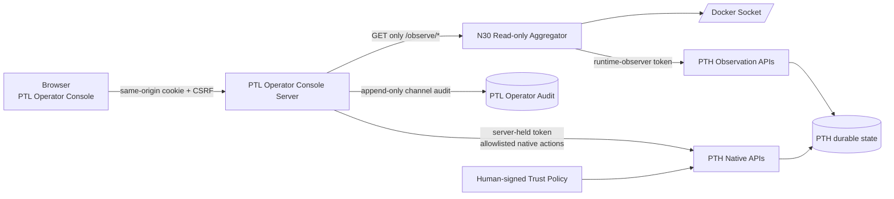

# N33：v1.3 PTL 五页操作台设计

> 日期：2026-08-19
>
> 状态：**已实施，验收 GO**（见 n33-operator-console-report.md；权威 envelope：n33-operator-console-envelope.json）
>
> 版本目标：v1.3.0
>
> 配套观测面：[N30 统一运行观测台](./n30-runtime-observatory-design.md)
>
> 配套工作模式与专业运行：[N32 v1.3 专业计算设计](./n32-v13-professional-computing-design.md)
>
> 实施计划：[2026-08-19 v1.3 PTL Operator Console（旧仓归档）](https://github.com/Phenol1145/pi-triple/blob/main/docs/superpowers/plans/2026-08-19-v13-ptl-operator-console.md)

## 0. 执行摘要

N33 建设一个默认只监听 loopback 的 PTL Operator Console，以五项固定侧边栏组织本机操作：

1. **总览**：复用 N30 的甘特图、资源折线、freshness 与告警；
2. **运行**：类型化配置、预览、发布与验收 `run`、`intake`、`optimize` 三种工作；
3. **调试**：选择 Worker Replica，观察其 Role revision、当前任务、责任区、工作集、工具/Skill 面和关联资源；
4. **记忆**：分页查询五类记忆，分别按条目数与正文体积绘制占比，展示最近十条 revision；
5. **配置**：只读展示 PTL/PTH 配置的默认值、有效值、来源、作用域、重启语义和全部 Role Definition。

操作台属于 PTL 的人类交互通道，不是 PTH 内部 `human-interface` worker，也不把 PTL 与 PTH
改造成前后端关系。PTH 仍拥有 Task、Intake Run、Optimizer、Memory、Role Catalog、Config 与
验收 envelope；操作台只做读取、命令预览、显式确认和原生入口适配。

v1.3 不引入统一 Workflow 抽象。一个 Operator Command 在提交前是 PTL 内存中的短期草稿；
提交后立即落到一个原生事实实体，并以其 ID、状态与验收证据为准。统一 Workflow/DAG 仍按
[N31](./n31-unified-workflow-dag-design.md) 留到 2.0。

## 1. 已确认裁决

### 1.1 产品边界

- 页面、浏览器会话、命令预览、CSRF 和本机人类确认归 PTL；
- Task、Intake、Optimizer、Memory、Role 与 Config 的事实和规则归 PTH；
- N30 是只读 Observation Plane，可独立运行，也可嵌入操作台总览；
- N33 的 Operator Control Plane 只映射登记动作，不提供通用 HTTP 代理或任意命令执行；
- `human-interface` 是 PTL 的按需语义角色，不进入 PTH batch worker 池；具体网页只是 Interaction Channel Adapter。

### 1.2 首版权限

| 页面 | v1.3 权限 | 明确禁止 |
|---|---|---|
| 总览 | 只读 | pause/resume/retry/cancel |
| 运行 | 登记动作可写，必须预览与确认 | 任意 URL、SQL、shell、未登记 API |
| 调试 | 只读 | 干预 Worker、读取 CoT、暴露 prompt/secret |
| 记忆 | 只读 | 直接写、删、归档、晋升 official |
| 配置 | 只读 | 在线编辑 secret、直接改环境变量或 Role |

配置变更若未来开放，必须先产生 `optimize` 提案并经过原有 canary/deopt 门，而不是在配置页直接保存。

### 1.3 选择的部署方式

采用“统一浏览器壳 + 分离后端权限”方案：

- PTL Operator Console 进程不挂载 Docker Socket；
- N30 Docker Monitor 只读 Docker Socket，不持有 PTH 写凭据；
- PTL 服务端持有 PTH 调用凭据，浏览器永不获得；
- 总览由 PTL 同源反向代理 N30 的只读页面、snapshot 与 SSE；
- 所有写请求只进入 PTL 的登记控制路由，再调用确切的 PTH 原生动作。

不采用以下方案：

- 扩大 `deploy/docker-monitor` 让它同时持有 Docker Socket 与 PTH 写凭据；
- 让 PTH Gateway 托管 PTL 页面；
- 浏览器直接访问 PTH、Docker Socket、Redis、PostgreSQL 或专业软件凭据。

## 2. 运行架构



浏览器只看到已裁剪 DTO、操作预览和原生 ID。PTL audit 只证明“哪个本机人类在操作台点击了什么”，
不替代 PTH 的服务端主体、Trust Policy、Approval Decision 或领域审计。

## 3. Operator Session 安全合同

### 3.1 启动与 bootstrap

规范入口为：

```text
ptl operator [--port 9091] [--no-open]
```

默认 host 固定 `127.0.0.1`。启动时生成 256-bit 单次 bootstrap token，打开：

```text
http://127.0.0.1:9091/#bootstrap=<one-time-token>
```

fragment 不进入 HTTP request 或 Referer。浏览器脚本将 token POST 到
`/api/session/bootstrap`；服务端核对 Host/Origin 后消费一次，设置 `HttpOnly; SameSite=Strict`
短期 cookie，并返回仅存内存的 CSRF token。URL fragment 随即由 `history.replaceState` 清除。

### 3.2 会话不变量

- Operator Session 只在内存中保存，默认空闲 30 分钟过期；服务重启后全部失效；
- POST 必须同时满足合法 cookie、Origin、Host 和 `X-PTL-CSRF`；
- 同一个 bootstrap token 只能成功一次；
- 不启用 CORS，不接受 wildcard Host，不允许非 loopback 监听；
- 页面、日志、错误、localStorage、sessionStorage、SSE 均不得含 PTH token 或 secret；
- 所有输出经内容类型与 HTML escaping；memory/content 永不写入 `innerHTML`；
- PTL audit 记录 principal、action、previewDigest、nativeRef、结果和时间，不记录 secret/正文。

非 loopback、多用户、远程 TLS/SSO 与租户自助属于后续版本，不能通过一个环境变量绕过首版边界。

## 4. 页面信息架构

### 4.1 共享壳

固定侧边栏：`总览 / 运行 / 调试 / 记忆 / 配置`。顶栏始终展示：

- 当前本机 operator principal；
- PTH tenant/space（服务端配置，浏览器不可改）；
- N30/PTH freshness；
- 当前时间窗；
- 连接/暂停状态。

页面路由使用 hash：`#/overview`、`#/work`、`#/debug`、`#/memory`、`#/config`。
刷新不需要服务端 SPA fallback。未授权会话只显示 bootstrap 页面。

### 4.2 总览

总览嵌入 N30 的 `embed=1` 只读视图：

- Job → Task → Intake/Optimize/Professional Stage 甘特图；
- CPU/RSS/Heap/Network 同轴折线；
- WorkMode、Role、status、时间窗筛选；
- freshness、clock skew、stale/disconnected 与告警；
- 点击区间显示 Worker/Role/Batch/Trace 和关联资源，不宣称 Task/Worker 精确资源归因。

PTL 只代理 `GET /`、`GET /snapshot` 与 `GET /events`。代理禁止 POST、Upgrade、任意目标 URL、
hop-by-hop headers 和重定向；N30 不可用时只降级总览，其余页面继续工作。

### 4.3 运行

运行页有三种固定 tab，但它们共享同一套四步交互：

```text
选择登记命令 → 类型化配置 → 服务端预览 → 显式确认提交 → 原生状态/验收
```

| WorkMode | v1.3 登记命令 | 原生事实源 | 验收投影 |
|---|---|---|---|
| run | task.publish、professional-job.publish、notebook.evaluate | Task / Professional Job | terminal outcome、artifact、专业验收、Notebook Run All |
| intake | subscription.create、intake.trigger、intake.retry | SourceSubscription / IntakeRun | revision/evidence/plan/verdict/promotion/recrawl evidence |
| optimize | suggestion.apply、canary.start、deopt.request | Optimizer proposal/task/canary | scorecard、guard、canary delta、rollback/deopt |

`intake` 只允许引用已经验签并安装的 human-signed Trust Policy；操作台首版不生成私钥、不自动扩大
source scope、不把普通确认当 Trust Policy 签名。`optimize` 不允许关闭 hard safety floor；`run` 不允许
直接写 official Knowledge 或系统配置。

每种登记命令由服务端 adapter 给出 JSON Schema-like 表单描述与归一化逻辑。预览返回：

```ts
interface OperatorCommandPreview {
  previewId: string;
  mode: "intake" | "optimize" | "run";
  action: string;
  normalizedInput: Readonly<Record<string, unknown>>;
  summary: readonly string[];
  impact: { scope: string; reversible: boolean; risk: "low" | "medium" | "high" };
  nativeTarget: string;
  previewDigest: string;
  expiresAt: string;
  confirmation: "required";
}
```

提交必须携带 `previewId + previewDigest + idempotencyKey`。服务端只接受未过期、未消费、内容完全相同的
预览；成功后返回原生引用：

```ts
interface NativeWorkRef {
  mode: "intake" | "optimize" | "run";
  kind: "task" | "professional-job" | "intake-run" | "optimizer-work";
  id: string;
  tenantId: string;
  submittedAt: string;
}
```

Operator Command 不持久化成新的工作状态机。浏览器后续查询 `NativeWorkRef`，验收按钮只运行登记的
evaluator/读取权威 envelope；不执行任意 shell，不允许上传脚本作为验收命令。

### 4.4 调试

调试页先按 Batch、Role、WorkMode、lifecycle 过滤 Worker Replica，再选定 `workerId`。详情包括：

- `WorkerReplicaRef`、Role Definition revision、batchId、heartbeat/lifecycle；
- 当前 Task/lease/work mode、最近结构化事件；
- Memory Responsibility region ID/权重/epoch；
- 当前 Task Working Set 的 memory/skill/tool ID 与预算 usage/omitted；
- 当前 action space 与专业 adapter 名称；
- 关联 Batch 资源曲线和 freshness。

不得展示：模型私有推理、完整 system prompt、secret、原始环境变量、未授权 memory content、任意文件。
首版没有 pause/resume/remove/retry/cancel 按钮；这些动作仍走已有 CLI/管理流程。

### 4.5 记忆

记忆页只读，且所有查询在数据库层带 tenant/status/space/time predicate 与 limit/cursor：

- 五类：setting、wiki、skill、log、index；
- 饼图 A：按当前可见条目数；
- 饼图 B：按当前可见正文 UTF-8 bytes；
- 表格：按 type/kind/status/anchor/更新时间过滤；
- 详情：正文、metadata、source/evidence、revision history；
- “近期修改”固定展示最近十条 **revision event**，不是被覆盖后的十个 entry。

当某一 Memory Type 为 0 条时仍显示 0；总分母为 0 时显示 empty，不画 100% 假饼图。正文默认不载入，
只有选择具体 entry 后才通过精确 ID 获取，并计入有界响应。

### 4.6 配置

配置页聚合两组只读目录：

1. PTL 本地配置：模板、默认模板、模型、路径与连接状态；
2. PTH typed config 与 Runtime Catalog Role Definitions。

每个配置项显示：key、group、type、default、effective、source、scope、runtime mutable、restart required、
description。secret 的 default/effective/source detail 一律显示 `***`，不得依据长度或是否设置泄漏特征。

Role 表显示：id、lineage parent、revision、family、tags、capabilities、action tools、thinking、
acceptance role、默认副本数和可选 cognitive budget/load policy 引用。页面只显示声明与当前 runtime snapshot，
不把 Role 当 Worker。

## 5. PTH 只读投影

为避免沿用当前 `/kernel/memory` 的无界 retrieve，PTH 新增 tenant-scoped read-only 端点：

```text
GET /api/v1/observe/workers
GET /api/v1/observe/memory/summary
GET /api/v1/observe/memory/entries?type=&kind=&status=&anchor=&cursor=&limit=
GET /api/v1/observe/memory/entries/:id
GET /api/v1/observe/memory/revisions?entryId=&cursor=&limit=
GET /api/v1/observe/config
GET /api/v1/observe/roles
```

共同规则：

- tenant/space 只取认证上下文；
- memory SQL 下推 visibility/status/time/cursor，禁止 retrieve-all 后过滤；
- 默认 limit 20，最大 100；recent revisions 固定 limit 10；
- config/role 输出经过显式 DTO，不序列化内部对象；
- worker 输出只含结构化观测字段，不含 prompt、正文或 secret；
- 所有端点只读，查询失败不回退到更宽范围。

## 6. PTL 控制适配器

控制服务只登记下列 adapter，不提供 `request(method,path,body)` 形式的通用入口：

```ts
interface OperatorModeAdapter<TInput> {
  readonly mode: "intake" | "optimize" | "run";
  readonly action: string;
  describe(): OperatorFormDescriptor;
  preview(input: unknown, context: OperatorContext): Promise<OperatorCommandPreview>;
  submit(preview: OperatorCommandPreview, context: OperatorContext): Promise<NativeWorkRef>;
  inspect(ref: NativeWorkRef, context: OperatorContext): Promise<NativeWorkProjection>;
  evaluate(ref: NativeWorkRef, context: OperatorContext): Promise<OperatorAcceptanceProjection>;
}
```

注册表使用 `(mode, action)` 唯一键。未知键、重复键、请求声明的 native path、额外字段、超预算、
跨 tenant/space、过期 preview 与重复消费全部拒绝。adapter 内部调用现有 `PthClient` 或新增窄方法；
不得 spawn 用户提供的命令、拼 shell 字符串或接受任意 HTTP URL。

## 7. 时效性与错误处理

- 总览沿用 N30 freshness contract；
- Worker 当前态默认 2 秒刷新，5 秒 lagging、15 秒 stale；
- Memory/Config/Role 是 snapshot 查询，页面显示 `observedAt`，手动或 30 秒刷新；
- Run native state 用 SSE hint + 5 秒 authoritative poll reconcile；
- 页面离线时保留最后快照并醒目标 stale，不延长运行中区间；
- POST 网络超时后不得自动重发；必须用相同 idempotency key 查询提交结果；
- PTH 控制成功而 PTL audit 失败时，页面显示 partial audit failure，并以 native ref 为准；
- N30、PTH read、PTH control 分别显示来源状态，不能用一个绿色 LIVE 掩盖局部断连。

## 8. 可访问性与响应式布局

- 侧边栏在窄屏折叠为顶部菜单，但页面 ID 不变；
- 所有图表有表格/文本等价视图；
- 饼图同时显示数字、比例与 legend，不只用颜色；
- 键盘可完成导航、过滤、选择、预览与确认；高风险确认必须聚焦摘要而不是默认按钮；
- `prefers-reduced-motion` 下禁用非必要动画；
- 状态色与 N30 一致，WorkMode 使用独立图形标识，不能覆盖状态语义。

## 9. 分层交付

### C0：安全壳与五页导航

本机 server、bootstrap/cookie/CSRF、静态资源打包、五页空态和 feature flag。

### C1：总览嵌入

只读代理 N30；验证 freshness、SSE 重连和 N30 故障隔离。

### C2：只读调试/记忆/配置

先建立 PTH 有界投影，再接三页；不开放任何写按钮。

### C3：运行命令预览与原生提交

按 run → intake → optimize 顺序增加登记 adapter；每一种独立验收，未知动作 fail-closed。

### C4：验收投影与权威门

读取 native evidence/envelope，完成安全、时效、可访问性、跨租户和真浏览器验收。

## 10. v1.3 验收条件

1. 五个页面可从单一 PTL 本机入口访问，刷新和深链不丢失；
2. 浏览器、页面源、storage、SSE、日志均没有 PTH token、Docker Socket path 或 secret；
3. N30 不可用只影响总览，PTH 不可用时所有写动作 fail-closed；
4. run/intake/optimize 各至少一个真实原生动作完成 preview→confirm→native ref→evaluate；
5. stale preview、重复确认、CSRF、Host/Origin、未知 adapter、任意 path/shell 均被拒绝；
6. intake 只能引用有效 human-signed Trust Policy，普通确认不能扩大来源信任；
7. 调试页按 workerId 观察，不暴露 CoT/prompt/secret，也不误称 Batch 资源为 Worker 独占资源；
8. Memory 五类的 count/bytes 分母准确，recent 10 来自 revision 事件，分页不全表读；
9. Config secret 全部恒定打码，Role Definition 与 Worker Replica 不混淆；
10. 操作台故障、关闭或卸载不影响 PTH/N30；feature 默认 off；
11. focused、全量、lint、build、浏览器可访问性和 security sabotage 全部进入 commit-bound envelope；
12. 没有引入统一 Workflow 状态机、通用控制代理或新的 PTH `human-interface` worker。

## 11. 明确后置

- 远程 TLS/SSO、多用户与公网部署；
- 浏览器内生成或托管 Trust Policy 私钥；
- 配置/Role/Memory 的直接编辑；
- Worker pause/resume/remove 或任意调试执行；
- 长期 operator audit 后端与跨设备会话；
- 多租户自助控制台；
- 2.0 统一 Workflow 构造器与跨模式图形编辑。
