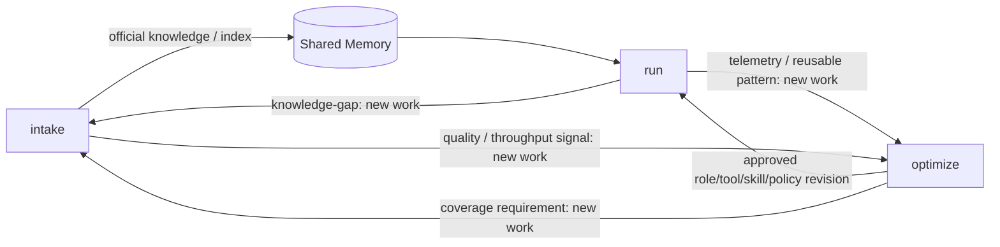
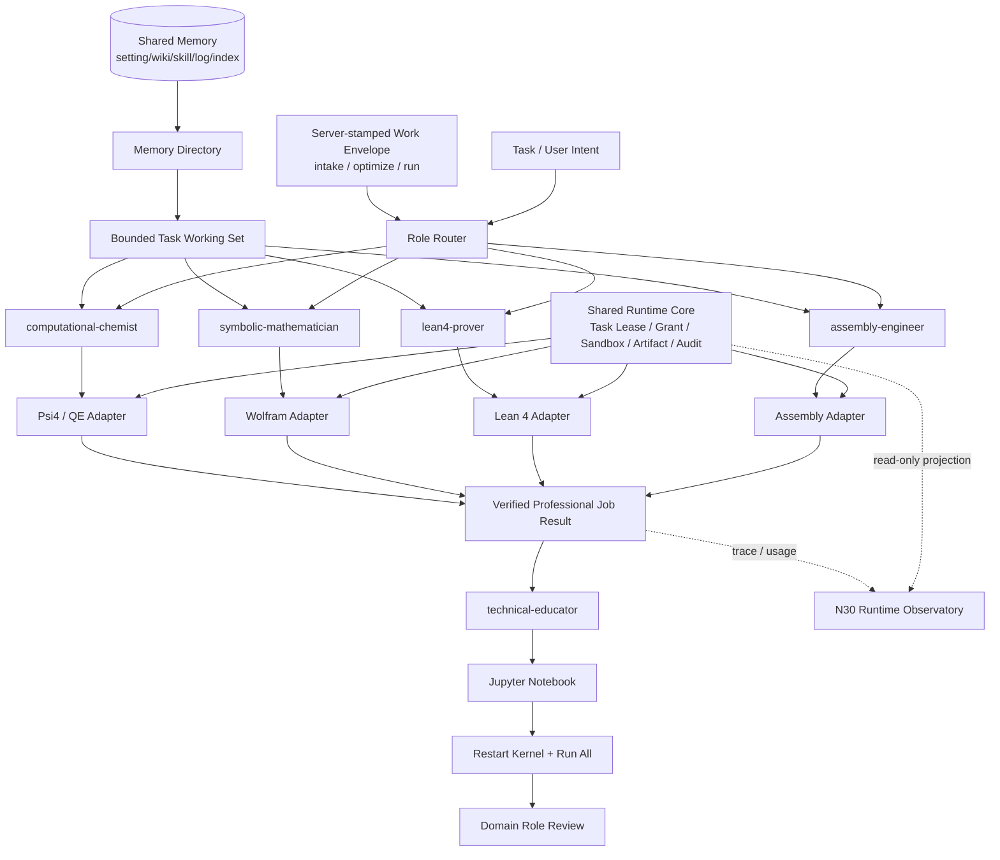

# N32：v1.3 专业计算角色与可执行教程设计

> 日期：2026-08-19
>
> 状态：**用户已确认；等待按实施计划执行**
>
> 目标版本：**v1.3.0**
>
> 配套观测面：[N30 统一运行观测台设计](./n30-runtime-observatory-design.md)
>
> 实施计划：[v1.3 专业计算实施计划](../superpowers/plans/2026-08-19-v13-professional-computing.md) ·
> [N30 运行观测台实施计划](../superpowers/plans/2026-08-19-n30-runtime-observatory.md)

## 0. 执行摘要

v1.3.0 用真实专业场景验证 PTH 已有的 Role、Worker Replica、Memory Responsibility、
Task Working Set、Execution Grant、Kernel/Tool Registry 和 artifact 设施。版本新增四个专业计算
Role 与一个教程编排 Role：

1. `assembly-engineer`：复杂汇编编写、构建、反汇编、调试和跨 ISA 验证；
2. `computational-chemist`：计算化学输入构造、受限作业执行、收敛检查和结果解释；
3. `lean4-prover`：Lean 4 定义、证明、诊断修复和无 `sorry` 验证；
4. `symbolic-mathematician`：Wolfram 为主的符号计算与数值交叉验证；
5. `technical-educator`：把已经验证的专业执行记录编译为可重放 Jupyter Notebook 教程。

五个 Role 共用同一套五类记忆（`setting/wiki/skill/log/index`）和同一个语言无关运行核心，
但使用各自受限的专业 Runtime Adapter。共享不等于全权限：角色只能看见冻结 Task Working Set，
只能调用 Role 与 Execution Grant 同时允许的适配器。

本版本同时交付 N30 C 方案 Web 运行观测台，用甘特图展示 Job/Task/Intake/Professional Job
区间，用同步折线图展示 CPU、RSS、Heap 和 Network。观测台只读，不成为执行事实源。

所有有限工作项由服务端盖章为三种 Work Mode 之一：`intake`、`optimize`、`run`。Mode 只表达
工作目的，可以并发；它不替代 Task/Intake 的原生状态机，也不等于 Role 或 Workflow。

## 1. 版本边界

### 1.1 v1.3.0 包含

- 将 `MemoryType` 从四类扩展为五类，新增 `index`；
- 建立只保存定位与版本信息的 Index Memory，按推理需要惰性加载正文；
- 建立统一 `ProfessionalRuntimeAdapter` 契约和稳定版本锁；
- 增加五个显式启用、默认副本数为 0 的 Role Definition；
- 建立 Assembly、Lean 4、Wolfram、Psi4、Quantum ESPRESSO 适配器；
- 建立 Jupyter Notebook 生成、干净内核执行和专业复核闭环；
- 实施 N30 O0–O4 本机管理员运行观测台；
- 用真实任务、真实工具输出、真实 artifact 和无新增 skip 的门禁验收。

### 1.2 v1.3.0 不包含

- 不实现 N31 的统一 Workflow Definition/Compiler/Run；该抽象留到 2.0；
- 不为每个 Role 建私有数据库、私有向量库或完整语料副本；
- 不让 LLM 自由拼接 shell 命令或直接接触软件进程；
- 不把 Notebook 历史输出当作成功证据；
- 不自动接受新的外部信息源；来源仍受 N29 TrustPolicy 与摄入门控制约束；
- 不在本版本开放多租户 Web 运维面；N30 O5 后置。

## 2. 三种工作模式

```ts
export type WorkMode = "intake" | "optimize" | "run";

export interface WorkEnvelope {
  workId: string;
  mode: WorkMode;
  objective: string;
  authorityPolicyRef: string;
  budgetPolicyRef: string;
  parentWorkId?: string;
  causationId: string;
}
```

| Mode | 目的 | 允许产生的权威结果 |
|---|---|---|
| `intake` | 获取、验证、消化信息 | SourceRevision、Index Memory、knowledge candidate、门禁后的 official knowledge |
| `optimize` | 改进系统自身 | Role/Skill/Tool/规则/参数/责任区提案与获准 revision |
| `run` | 完成用户或系统任务 | Task result、artifact、Notebook、执行日志和诊断 |

映射规则：

- N29 来源发现、fetch/admit/extract/verify/promote、recrawl/stale 都是 `intake`；
- JIT/控制论/资源/工具/记忆/规则优化、Role 分化、Skill/Tool 晋升和 deopt 都是 `optimize`；
- 普通 Task、四类专业计算和 Notebook 教程生产都是 `run`；
- Trigger、lease、outbox、retry、guard、N30 和 PTL Human Interface 是基础设施或边界，不单独占用 Mode；
- 委派默认继承 Mode；跨模式必须创建新的 workId、封套、authority、budget 和审计记录；
- `run` 只能通过 knowledge-gap 新建 `intake`，通过 telemetry/proposal 新建 `optimize`；
- `intake` 不修改运行配置，`optimize` 不把未授权来源写成知识，`run` 不直写 official knowledge 或系统配置。



### 2.1 与其他轴的关系

| 轴 | 回答的问题 |
|---|---|
| Work Mode | 为什么工作 |
| Role Definition | 谁、用什么稳定方法工作 |
| Workflow/Task | 工作如何分解与依赖 |
| Status | 当前执行到哪里 |
| Runtime Adapter | 使用什么软件执行 |

同一个 Role 可以参与不同 Mode，但每个有限工作项只有一个 Mode。Mode 不能原地改变。

## 3. 总体结构



## 4. Role 谱系

Role 表达稳定工作方式，不表达软件进程或学科目录。专业 Role 不进入默认 batch；只有 Profile 或
`PTH_WORKER_ROLES` 显式指定时才产生 Worker Replica。

| Role | Parent | Generation | 主要产物 | 允许的专业适配器 |
|---|---|---:|---|---|
| `assembly-engineer` | `developer` | 4 | 可运行二进制、反汇编、测试与性能证据 | `assembly` |
| `computational-chemist` | `solver` | 5 | 输入文件、收敛轨迹、结构/能量结果 | `psi4`, `quantum-espresso` |
| `lean4-prover` | `solver` | 5 | 无占位证明、编译诊断、依赖锁 | `lean4` |
| `symbolic-mathematician` | `solver` | 5 | 表达式、假设、消息、数值复核 | `wolfram` |
| `technical-educator` | `writer` | 4 | 可执行 Notebook、环境锁、教学清单 | `jupyter` |

`technical-educator` 不继承通用 shell、化学软件或证明器权限。它消费已验证 Professional Job Result，
需要新计算时必须委派给对应专业 Role。

## 5. 五类共享记忆

| Memory Type | 内容 | 专业场景示例 |
|---|---|---|
| `setting` | 运行环境、版本、配置、许可证和资源策略 | ISA、Lean toolchain、basis、functional、kernel license |
| `wiki` | 概念、原理、定义与理论关系 | ABI、量子化学方法、类型论、符号代数 |
| `skill` | 可执行 SOP 与故障处理规程 | 链接、收敛诊断、证明修复、假设管理 |
| `log` | 历史运行、失败、性能和经验 | 编译错误、SCF 轨迹、proof diagnostics、kernel messages |
| `index` | 资源的轻量导航记录 | 手册章节、API 符号、Mathlib theorem、软件文档 locator |

### 5.1 Index Memory 规则

Index Memory 只描述“有什么、在哪里、哪个版本、如何精确读取”，不保存完整正文。最小记录包含：

```ts
export interface IndexMemoryRecord {
  entryId: string;
  sourceId: string;
  product: string;
  version: string;
  releaseChannel: "stable";
  canonicalUri: string;
  artifactHash: string;
  locator: { kind: "heading" | "symbol" | "line-range" | "json-pointer"; value: string };
  domains: readonly string[];
  license: string;
}
```

- 一个索引节点可以描述一组现有记忆或一个外部 artifact 区间；
- 现有 `setting/wiki/skill/log` 正文不迁移、不复制；
- 惰性读取必须经过 tenant/space/status/grant 校验并计入同一 Cognitive Budget；
- 只索引最新稳定版本；版本升级产生新索引 revision，旧版本只保留历史引用；
- 未命中精确 locator 时不得退化成把整份 GB 级语料载入上下文。

## 6. 专业运行适配器

### 6.1 统一契约

```ts
export type ProfessionalRuntimeId =
  | "assembly"
  | "lean4"
  | "wolfram"
  | "psi4"
  | "quantum-espresso"
  | "jupyter";

export interface ProfessionalRuntimeAdapter<SPEC, RESULT> {
  readonly id: ProfessionalRuntimeId;
  probe(): Promise<{ available: boolean; version: string; releaseChannel: "stable"; reason?: string }>;
  execute(input: ProfessionalJobRequest<SPEC>): Promise<ProfessionalJobResult<RESULT>>;
  cancel(jobId: string): Promise<boolean>;
}
```

共性要求：

- 输入必须是适配器拥有的判别联合类型，禁止接受 LLM 提供的任意 `command/argv`；
- 请求绑定 Task Lease、Execution Grant、Worker Replica、tenant、space 和 deadline；
- stdout/stderr、源文件、二进制、证明、结构和大结果写 artifact store；
- 返回值包含工具版本、输入/输出 hash、退出状态、诊断、资源使用和 traceId；
- cancel、timeout、输出上限、工作区路径和环境变量白名单由运行核心强制；
- LLM 的文字判断不改变成功状态；成功只由适配器验证器产生。

### 6.2 专业验收场景

#### Assembly

- x86-64、AArch64、RISC-V 三目标至少各完成一个非平凡例程；
- 检查 ABI、链接、反汇编、测试向量和模拟器/原生结果；
- 与参考实现比较正确性；性能结论必须带测量环境和样本。

#### Lean 4

- 使用固定 Lean 4/Lake/Mathlib 稳定版本；
- 干净工程编译成功；
- 源码中 `sorry`、`admit`、未关闭目标为零；
- 保存 theorem、依赖锁、diagnostics 和构建 hash。

#### Wolfram

- 启动前验证许可证与 kernel 版本；
- 输出表达式、完整 assumptions、messages 与时限；
- 对可采样结果进行数值交叉验证；
- Wolfram 不可用时明确 `unavailable`，不得静默改用其他引擎并冒充同一结果。

#### Computational Chemistry

- 首先用 Psi4 验证分子单点能与结构优化；
- 再用 Quantum ESPRESSO 验证小型周期体系 SCF；
- 记录几何、charge/multiplicity、方法、basis/pseudopotential、收敛阈值与软件版本；
- 超资源预算的作业在启动前拒绝；不收敛必须返回结构化 `not-converged`。

## 7. Jupyter 可执行教程

Notebook 是教学投影，不是知识或执行事实源。每份 Notebook 必须绑定：

```ts
export interface NotebookGuideManifest {
  notebookId: string;
  title: string;
  educatorRoleRevision: string;
  reviewerRoleRevision: string;
  sourceJobIds: readonly string[];
  sourceArtifactHashes: readonly string[];
  kernelId: string;
  runtimeLockHash: string;
  notebookHash: string;
  executedNotebookHash: string;
  status: "draft" | "executed" | "reviewed" | "rejected";
}
```

教程至少包含目标、前置知识、环境、分步操作、预期输出、常见错误、练习、来源和版本。验收必须在
干净 kernel 中执行 `Restart Kernel and Run All` 等价流程，禁止隐藏状态、凭据、宿主绝对路径和
内嵌大二进制。Notebook 中的历史输出不能替代本轮执行记录。

## 8. N30 Web 视图的 v1.3 位置

N30 与专业计算并行实现，复用相同 `taskId/workerId/roleId/traceId`：

- 甘特图新增 Professional Job 区间，但不改变专业作业状态；
- 甘特图和筛选器显示 `intake/optimize/run`，但颜色不替代原生 status；
- 资源折线关联 adapter 进程或容器的 CPU/RSS/Heap/Network；
- Notebook 执行显示为 Jupyter Professional Job；
- 页面 stale/dead/断流时冻结并明确标记，不补造零值；
- 浏览器不持有 Docker Socket、PTH 管理 token 或专业软件凭据。

## 9. 交付里程碑

| Milestone | 交付 | 独立验收 |
|---|---|---|
| M0 | WorkMode/WorkEnvelope 服务端盖章与跨模式新工作项 | Task/Intake/Optimizer 映射、继承/跨模式/越权负测 |
| P0 | 五类记忆与 Index Memory 惰性加载 | 五类分类、索引完整性、预算与授权负测 |
| P1 | 统一专业 Runtime 契约、版本锁、五个 Role | 未授权角色/适配器为零调用；版本均为 stable |
| P2 | Assembly + Lean 4 垂直切片 | 真实三 ISA + 无 `sorry` Lean 工程 |
| P3 | Wolfram + Psi4 + QE 垂直切片 | 许可证/资源/收敛/版本门全绿 |
| P4 | technical-educator + Notebook 闭环 | 四份教程干净执行并由相应专业 Role 复核 |
| P5 | N30 O0–O4 | 甘特/折线联动、Freshness、真实 Docker+PTH 组合验收 |
| P6 | v1.3 综合验收 | 五 Role 共享记忆与核心；全量、lint、build、无新增 skip |

M0 → P0 → P1 → P2 是首条关键路径。P3 可在 P2 的统一契约稳定后并行；P4 依赖至少一个专业结果；
P5 与 P0–P4 并行，但 P6 必须同时满足专业计算和 N30 门禁。

## 10. 最终版本门

v1.3.0 只有在以下条件全部满足时才能发布：

1. 每个 durable work 都有服务端盖章的 intake/optimize/run，跨模式不原地变更；
2. 五种 Memory Type 均有正例、未知 kind fail-closed；
3. Index Memory 没有复制语料正文，惰性读取受同一授权与预算约束；
4. 五个 Role 的 revision、capability、tool face、memory responsibility 与 budget 已冻结；
5. 四个专业场景使用真实软件完成，适配器不可用不计 PASS；
6. 四份 Notebook 在干净环境全量执行并完成专业复核；
7. N30 O0–O4 的 mode/freshness、资源上限、安全与可访问性验收通过；
8. N29 最小可信摄入内环原有门禁不回退；
9. focused、全量、lint、build 均成功，skip manifest 无新增；
10. 权威 acceptance envelope 绑定包含实现与报告的同一 clean commit；
11. N31 Workflow 抽象没有被偷渡进 v1.3 实现。
